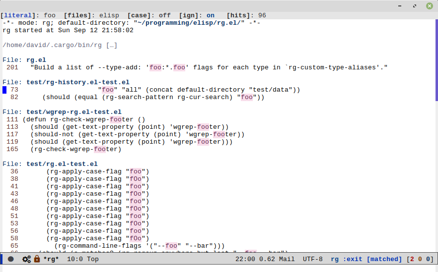

# rg.el

[](LICENSE)
[](https://stable.melpa.org/#/rg)
[](http://melpa.org/#/rg)
[](https://travis-ci.org/dajva/rg.el)
[](https://coveralls.io/github/dajva/rg.el)

Use [ripgrep](https://github.com/BurntSushi/ripgrep) in Emacs.

Ripgrep is a replacement for both grep like (search one file) and ag
like (search many files) tools. It's fast and versatile and written in
Rust. For some introduction and benchmarks, see
[ripgrep is faster than {grep, ag, git grep, ucg, pt, sift}](http://blog.burntsushi.net/ripgrep/).

This package let you run `ripgrep` like `grep` from within Emacs.



## Installation

This package is available on
[MELPA Stable](https://stable.melpa.org/#/rg) and
[MELPA](http://melpa.org/#/rg). Install with `M-x package-install`
<kbd>RET</kbd> `rg` from within Emacs.

If you want to install manually just put `rg.el` somewhere in your
load path and add this to `init.el`

``` el
(require 'rg)
(rg-enable-default-bindings (kbd "M-s"))
```

`rg` and friends is an autoloaded symbol so it's also possible to
defer loading if you have autoloading setup.

### wgrep

The default configuration of this package is compatible with `wgrep`.
If grouped mode and/or show columns is enabled you need to install the
[wgrep-ag](http://melpa.org/#/wgrep-ag) package from MELPA and
configure it like this:

``` el
(add-hook 'rg-mode-hook 'wgrep-ag-setup)
```


## Usage

### Main entry point - `rg`
Invoke by `M-x rg`. This works the same way as `M-x rgrep`,
i.e. you get an interactive prompt to enter search details. Universal
argument can be used as for `rgrep`.

### Project search - `rg-project`
`M-x rg-project` searches in a project defined by
[projectile](https://github.com/bbatsov/projectile),
[find-file-in-project](https://github.com/technomancy/find-file-in-project)
or a `vc-backend`.

### Do what I mean - `rg-dwim`
`M-x rg-dwim` searches for _thing at point_ in a project in all files
with the same type alias as the current buffer file.

### Literal search - `rg-literal`
`M-x rg-literal` is a non regexp version of `rg`.

### Saving searches
A search result buffer can be saved by invoking `rg-save-search` or
`rg-save-search-as-name`. The former will give the saved buffer a
unique name and the latter will prompt the user for a name. The
`rg-list-searches` command will open a buffer with all active
`rg-mode` buffers showing basic information about each search.

### Type aliases

[ripgrep](https://github.com/BurntSushi/ripgrep) has its own built in
mappings from type names to file name patterns that can be selected
from `rg.el` on invocation of `rg`. It's also possible to specify a
custom file name pattern in the files prompt.

There are some aliases with special meanings in `rg.el`.

| Name | Meaning |
|-----|--------|
| _all_ | all defined types including `rg-custom-type-aliases` |
| _everything_ | all files, i.e. running rg without `--type` flag |
| _custom_ | used internally in ``rg.el`` for mapping custom globs. Do not use this in `rg-custom-type-aliases` |

### Key bindings
This package comes with a set of predefined key bindings that can be
enabled by calling `rg-enable-default-bindings` with an optional
prefix key of choice. The default prefix is `C-c s` and can be
customized with [rg-keymap-prefix](#rg-keymap-prefix).
It is also possible to set the prefix when invoking `rg-enable-default-bindings`.

```el
(rg-enable-default-bindings "\M-s")
```

| Key | Binding |
|-----|--------|
| `<prefix> d` | `rg-dwim` |
| `<prefix> k` | `rg-kill-saved-searches` |
| `<prefix> l` | `rg-list-searches` |
| `<prefix> p` | `rg-project` |
| `<prefix> r` | `rg` |
| `<prefix> s` | `rg-save-search` |
| `<prefix> S` | `rg-save-search-as-name` |
| `<prefix> t` | `rg-literal` |

### The \*rg\* buffer
The `rg` results buffer has bindings for modification of the last
search for quick reruns with refined parameters.

| Key | Description |
|-----|--------|
| `c` | Toggle case insensitive setting |
| `d` | Change directory |
| `f` | Change file pattern |
| `g` | Rerun search |
| `i` | Toggle `--no-ignore` flag |
| `l` | List search buffers in a separate buffer |
| `r` | Edit search string as regexp |
| `s` | Save search result to unique name |
| `S` | Save search result, prompt for name |
| `t` | Edit search string as literal |

## Customize

### `rg-custom-type-aliases`
Custom type patterns as for rgrep are supported via customizing of
`rg-custom-type-aliases`.

```el
(setq rg-custom-type-aliases
  '(("foo" .    "*.foo *.bar")
    ("baz" .    "*.baz *.qux")))
```

You may also add lambdas to `rg-custom-type-aliases` to add aliases
dynamically based on mode, directory, project, etc.

```el
 (add-to-list
  'rg-custom-type-aliases
  (lambda ()
    (when (in-frontend-app)
      (cons "ui" "*.js *.hbs *.json"))))
```

### `rg-command-line-flags`
Additional command line flags that will be appended to the ripgrep
command line. Must either be a list of flags or a function that
returns a list of flags.

### `rg-group-result`
Controls the layout of the results buffer. If non `nil`, each file
name is displayed once and matches are grouped under that filename
instead of repeating the filename on each match. This is essentially
the layout of the `--no-heading` ripgrep command line flag.
Default value is `nil` (off).

### `rg-show-columns`
Controls if column numbers are used in the search result.
Default value is `nil` (off).

### `rg-ignore-case`
Variable that controls when case sensitive search is made or not.
The following values can be set:

### `rg-hide-command`
Hide most of command line by default. This is enabled by default and
can be set to `nil` to show full command line by default.

| Symbol | Description |
|-----|--------|
| `'case-fold-search` | Smart search based on `case-fold-search` setting. |
| `'smart` | Smart search. Case sensitive if at least one character is uppercase, otherwise ignore case. |
| `'force` | Force ignore case. |
| `nil` | Always case sensitive search. |

### `rg-keymap-prefix`
This variable sets the default prefix used for the global key
bindings. Note that `rg-enable-default-bindings` needs to be invoked
for the bindings to be enabled.

### `rg-show-header`
Controls if the search info header is shown in the result
buffer. This is enabled by default but can be disabled by setting this
variable to `nil`.

### `rg-define-toggle`
This is a macro that can be used to define custom `ripgrep` flag
toggling functions in the rg result buffer. The macro takes the flag
(and potential value) as an argument and optionally binds the toggle
function to a key and enable the flag by default.

The function defined by this macro will be named as the flag name
stripped with leading dashes and prefixed with `rg-custom-toggle-flag-`.

```el
(rg-define-toggle "-uu" "I" t)

```
Creates a function named `rg-custom-toggle-flag-uu` that is on by
default and bound to <kbd>I</kbd> in `rg` result buffer.

``` el
(rg-define-toggle "--context 3" (kbd "C-c c"))
```
Creates a function named `rg-custom-toggle-flag-context` that is off by
default and bound to <kbd>C-c c</kbd> in `rg` result buffer.

### `rg-define-search`
This macro can be used to define custom search functions in a
declarative style. Default implementations for common behavior is
available and custom forms can also be used. See the package
documentation for details.

Example:

``` el
(rg-define-search search-home-dir-in-elisp
  "Doc string."
  :query ask
  :format literal
  :files "elisp"
  :dir (getenv "HOME"))
```

## Contribute

- Install [cask](http://cask.github.io/).
- Install dependencies:

``` Shell
make deps
```
- Run tests:

``` Shell
make test
```


## License

See [LICENSE](LICENSE).
